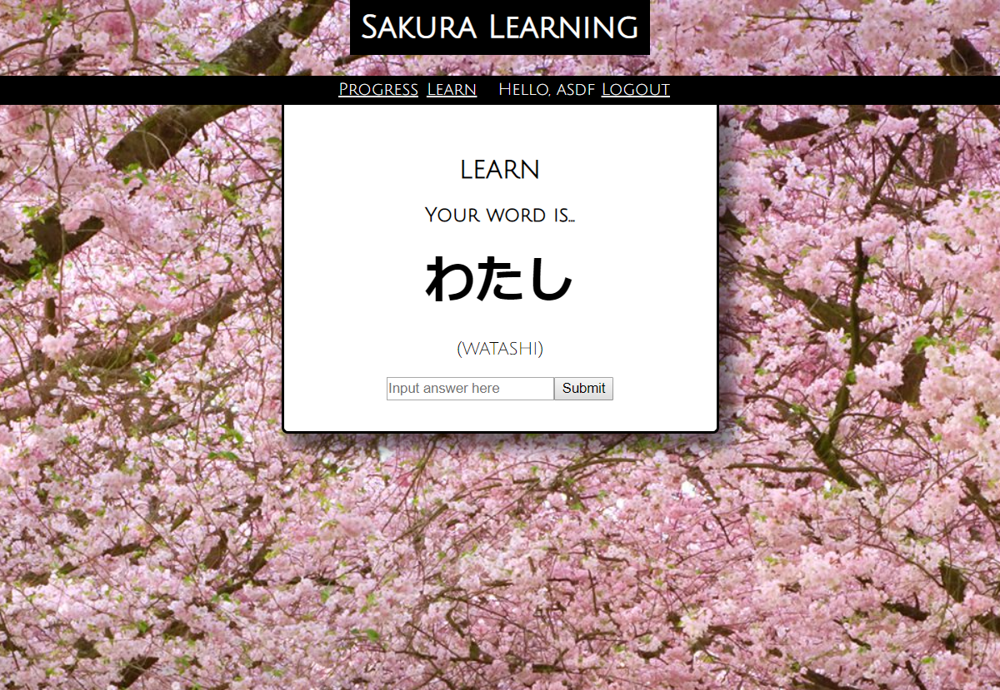
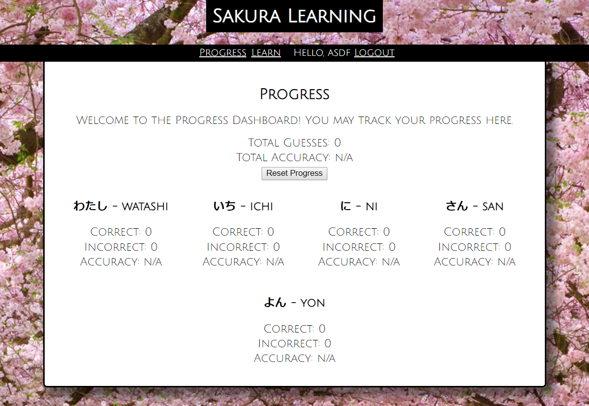

## Sakura Learning

Users can register as a new user and log in to start learning Japanese. A Japanese word and its phonetic will be displayed. 

Upon entering the word in the input box, you will be notified immediately whether you got it right or wrong. The user will be notified of the right answer if the wrong answer was submitted. Progress will be saved when a user logs out and back in.

 Efficient learning is utilized via a spaced repetition algorithm employed on the back end and and saved as an array. The essence of a Linked List is used to deploy the algorithm.

Users can also view their past progress of correct and incorrect answers to other vocabulary terms and view their percentage scores. 

All endpoints are protected via JWT authentication. As such, each user's experience is personalized.

## Live App

A live version of the site may be found here: https://spaced-rep-client-dev.herokuapp.com/

```
Username: demo
password: demopassword
```

## Screenshots



The Learn page, where users learn the vocabulary.



The Progress page, where users can track their performance.


## Technology
React and Redux are used on the front-end (with Create React-App and Buildpack for Heroku).
NodeJS and as well as Mongoose and Express are used on the back-end with MongoDB as the database storage. 

The the live version was published to Heroku - both client and server side.

NPM Modules used are:

  * Front-end
    1. Dotenv
    2. Enzyme
    3. Jwt-decode
    4. React
    5. React-dom
    6. React-router-dom
    7. React-Redux
    8. Redux
    9. Redux-thunk
    
  * Back-end
    1. Bcryptjs
    2. Cors
    3. Dotenv
    4. Express
    5. Passport
    6. Passport-jwt
    7. Passport-local
    8. Mongoose
    9. Morgan
    
The repo for the backend server may be found here:

https://github.com/thinkful-ei22/kev-dev-spaced-rep-server

This project was bootstrapped with [Create React App](https://github.com/facebookincubator/create-react-app).

